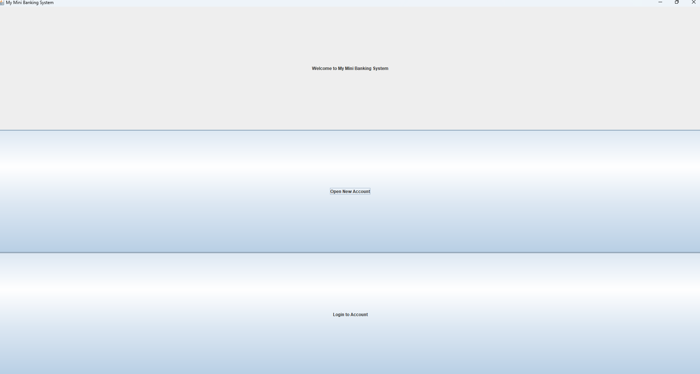
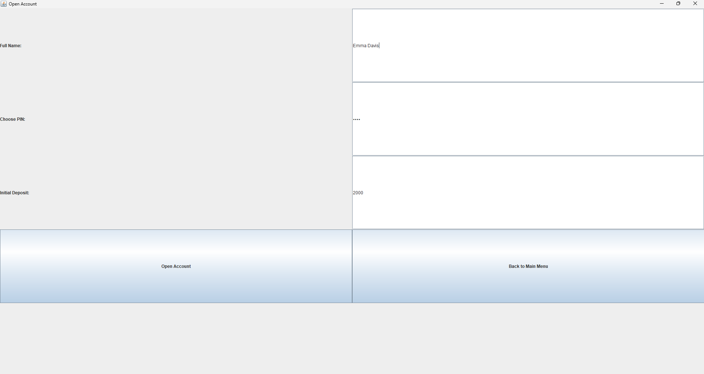
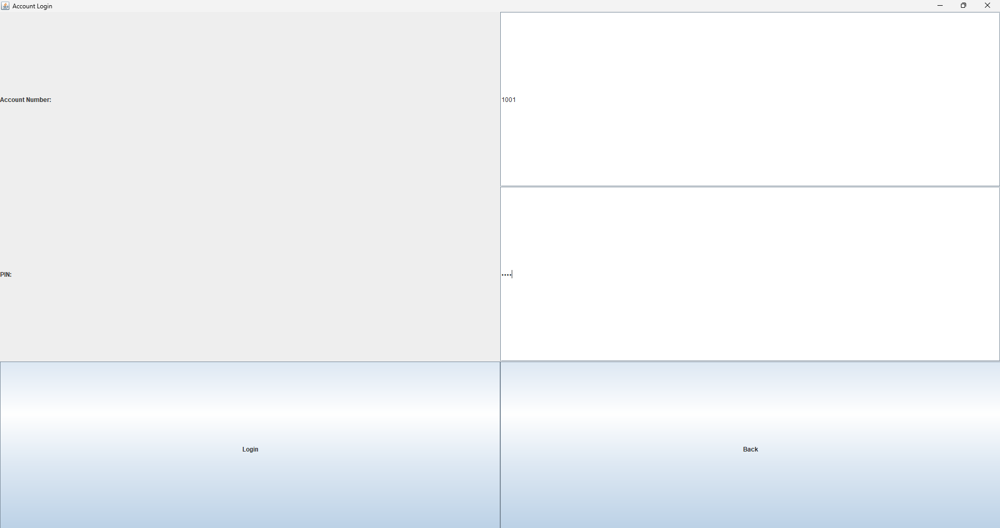
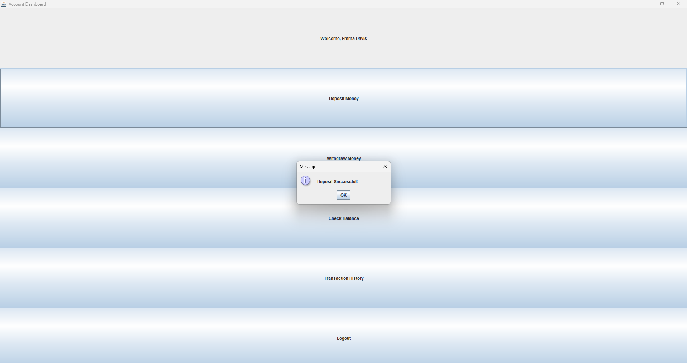
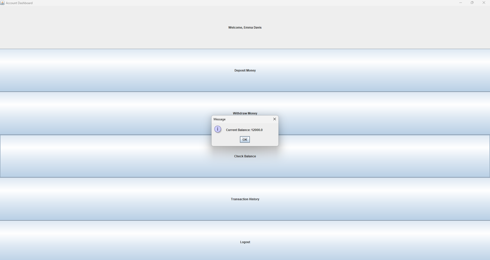

# My Mini Banking System

## Overview
This project is a *GUI-based Mini Banking System* built in Java.  
It allows users to manage bank accounts with basic banking operations.

---

## Features
- Open a new account with a name and initial deposit
- Login to an existing account
- Deposit money into your account
- Withdraw money from your account
- View total account balance
- Simple, easy-to-use GUI interface

---

## How It Looks

### Welcome Screen

### Open Account Screen

### Login Screen

### Deposit Confirmation

### Balance Display

---

## How to Run
1. Open this project in *IntelliJ IDEA*
2. Run MiniBankingGUI.java
3. Use the GUI to create accounts, deposit money, and check balances

